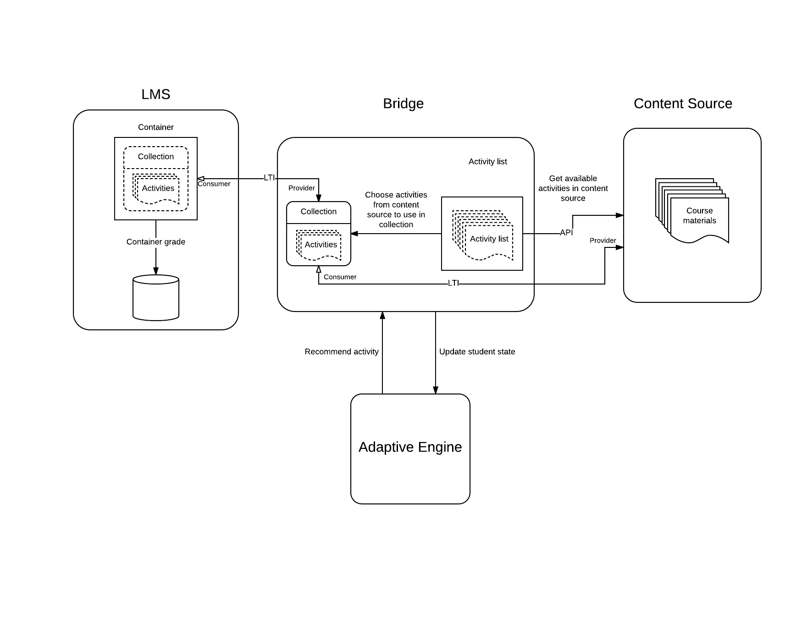

# Bridge for Adaptivity

[](https://travis-ci.org/harvard-vpal/bridge-adaptivity)
[](https://codeclimate.com/github/harvard-vpal/bridge-adaptivity/maintainability)

## About

An application that interfaces with an adaptive engine to dynamically serve
content in MOOCs based on real time student activity.

### The ALOSI adaptivity ecosystem
The Bridge for Adaptivity is designed to work with three external
systems to enable adaptivity in a course. These are:
* LMS (Learning Management System), for example edX, Open edX, Canvas or
other LTI consumers
* Content Source - contains the content (problems, html content) to
serve dynamically. Examples of a content source system might be Open edX
or other LTI providers.
* Adaptive Engine - Provides activity recommendations based on student activity.
An example of an adaptive engine application is the [ALOSI adaptive engine](https://github.com/harvard-vpal/adaptive-engine).


### More information

Visit our [github wiki](https://github.com/harvard-vpal/bridge-adaptivity/wiki)
or the [ALOSI Labs site](http://www.alosilabs.org/) for more information about
our group and our work.

## Containers list

- Container with Bridge for Adaptivity application

- Container with postgressql database

- Container with celery worker

- Container with rabbitmq message queue

- Container with nginx (doesn't exist for local deployment)

## Getting started

### Deployment

Deployment is based on the `Docker` containers. There are three config
files `docker-compose_local.yml`, `docker-compose-stage.yml` and `docker-compose.yml` for local
, stage and production deployments respectively.

Docker and Docker Compose are required to be installed before start
the deploying.

Clone project.

Before running deployment configure `secure.py` settings in the
`bridge_adaptivity/config/settings/` directory (see
`secure.py.example`).

### Local deployment

Local deployment can be started by the make command in the
console in `bridge_adaptivity` directory:

    [sudo] make run-local

Volume "pgs" is added to the the database container.

  Note: Development server available on `localhost:8008`


### Running tests

You can run tests locally (directly on your host), or on the docker machine.

* to run tests locally:
    * install requirements with command `pip install -r requirements_local.txt`
    * run tests: `python manage.py test --settings config.settings.test` or just `pytest`. Both commands are equal.
* to run tests in docker container:
    * create docker container: `make run-local`
    * run tests: `docker exec -it BFA pytest`
        * if you see an error:
          ```
          import file mismatch:
          which is not the same as the test file we want to collect:
          /bridge_adaptivity/config/settings/test.py
          HINT: remove __pycache__ / .pyc files and/or use a unique basename for your test file modules
          ```
          you should run: `find . | grep -E "(__pycache__|\.pyc|\.pyo$)" | xargs rm -rf`
          and after that retry running the tests: `docker exec -it BFA pytest`


### Staging deployment

Please ensure that file in `nginx/stage/bridge.conf` exists and
is configured in proper way.

Run make command to start staging deployment:

    [sudo] make run-stage


### Production deployment

Please ensure that file in `nginx/prod/bridge.conf` exists and
is configured in proper way.

Run make command to start production deployment:

    [sudo] make run

### Additional notes

- if `requirements` changes were made containers rebuilding needed:


    [sudo] make docker-build

- For run migration(production, stage and local): 


    [sudo] make migrate

    [sudo] make migrate-stage

    [sudo] make migrate-local
